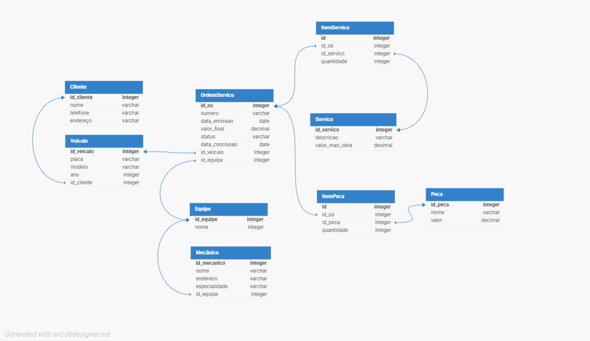

# 🛠️ Oficina Mecânica - Diagrama Conceitual / Conceptual Schema

## 📚 Descrição (PT-BR)

Este projeto foi desenvolvido como parte de um desafio de modelagem conceitual.  
O objetivo é representar, através de um **diagrama Entidade-Relacionamento (ER)**, o funcionamento de uma **oficina mecânica** que controla ordens de serviço (OS).

### 🧩 Contexto
- Clientes levam veículos à oficina para conserto ou revisão.  
- Cada veículo é designado a uma **equipe de mecânicos** que identifica os serviços a serem executados e preenche uma **OS (Ordem de Serviço)** com data de entrega.  
- Cada serviço possui um valor baseado em uma **tabela de referência de mão de obra**, e as **peças** utilizadas também compõem o custo final da OS.  
- O cliente **autoriza a execução** dos serviços.  
- Os **mecânicos** possuem código, nome, endereço e especialidade.  
- Cada OS possui número, data de emissão, valor total, status e data de conclusão.

### 🖼️ Diagrama
Abaixo está o modelo conceitual criado para representar o sistema:

---

## 🇺🇸 Description (EN)

This project was developed as part of a conceptual modeling challenge.  
The goal is to represent, through an **Entity-Relationship (ER) diagram**, the operations of a **mechanical workshop** that manages service orders (OS).

### 🧩 Context
- Clients bring vehicles for repair or maintenance.  
- Each vehicle is assigned to a **mechanic team** that identifies services to be performed and fills out a **Service Order (SO)** with a delivery date.  
- Each service has a value based on a **labor reference table**, and **parts** used also contribute to the total cost.  
- The client **authorizes** the execution of services.  
- **Mechanics** have code, name, address, and specialty.  
- Each SO includes an ID number, issue date, total value, status, and completion date.

### 🖼️ Diagram
Below is the conceptual model created for this system:

---

## ✍️ Autor
**Álvaro Gonçalves Rodrigues**  
Desafio do curso de modelagem de dados - DIO 
